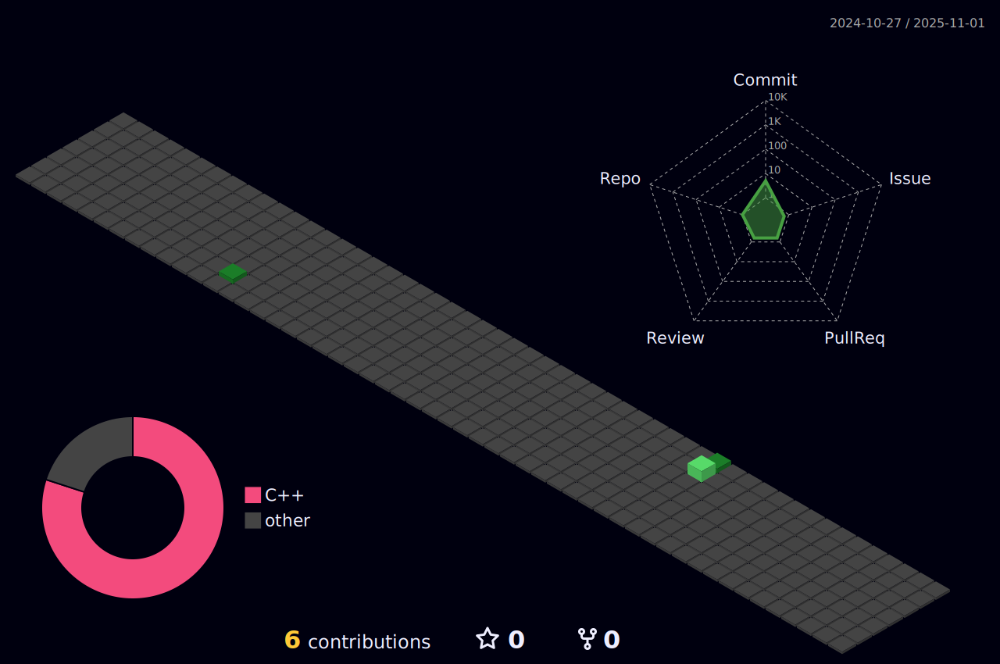

 

<h2 align="center"> About Me </h2>

 
 
 

- 🔭 I’m currently working at Máquinas Agricolas Jacto S/A

- 🌱 I’m currently learning Data Science
  
- 💬 Ask me about SQL, NoSQL, Java, C#, JavaScript, IA, Machine Learning
  
- ⚡ Fun fact: I'm Mechanical Engineer and i'm migrating to Data Sciences.

<table align="center" border="none">
<tr border="none">
<td width="50%" align="center" border="none">  </td>
<td width="50%" align="center" border="none"></td>
</tr>
</table>

------

<h2 align="center">Technology Stack </h2>

<!----><!----><a href="https://www.figma.com"></a><!----><!----><!----><!----><!----><!----><!---->

<h2 align="center">Reach me out on </h2>

------

<picture>
  <source media="(prefers-color-scheme: dark)" srcset="https://github.com/MarceloZanguettin/MarceloZanguetti/raw/output/github-contribution-grid-dark-snake" />
  <source media="(prefers-color-scheme: light)" srcset="https://github.com/MarceloZanguettin/MarceloZanguetti/raw/output/github-contribution-grid-snake" />
  
</picture>

